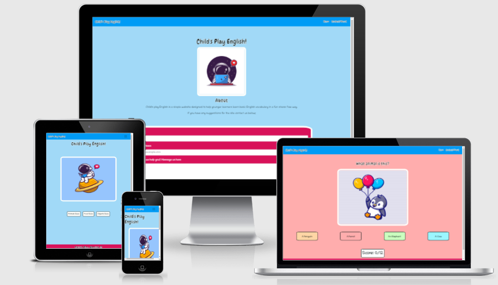
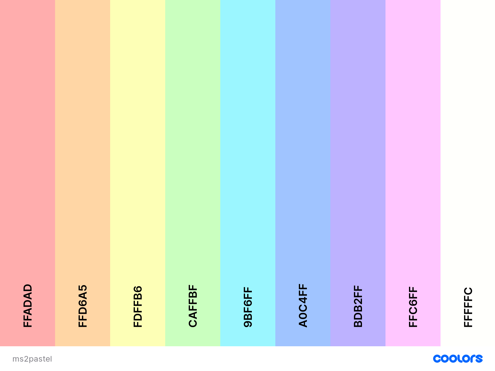
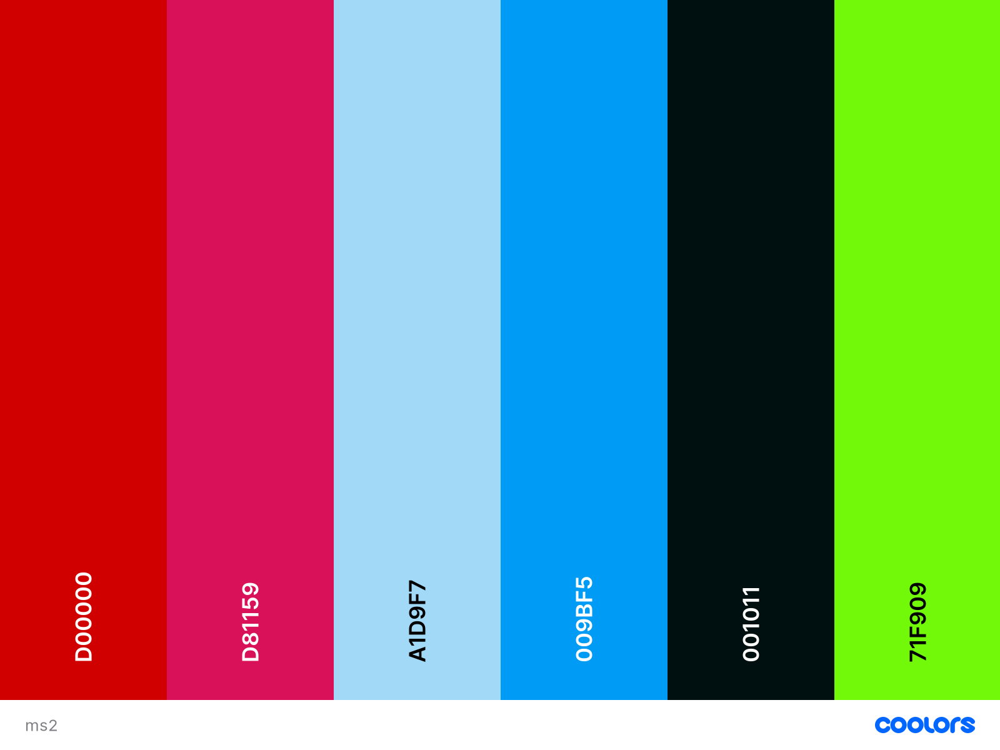

# Contents
* [UX](#UX)
    * [Strategy](#Strategy)
       * [Project Goals](#Project-Goals)
       * [User Stories](#User-Stories) 
    * [Structure](#Structure)
       * [Existing Features](#Existing-Features) 
            * [Navigation](#Navigation)
            * [Footer](#Footer)
            * [Images](#Images)
            * [Buttons](#Buttons)
            * [Alerts](#Alerts)
            * [Score Counter](#Score-Counter)
            * [Contact/About Page](#Contact/About-Page)
            * [404 Page](#404-Page)
       * [Features Left To Implement](Feature-Left-To-Implement)  
       * [Design](#Design)
            * [Colors](#Colors)
            * [Typography](#Imagery)
            * [Imagery](#Imagery)    
    * [Skeleton](#Skeleton)
      * [Wireframes](#Wireframes)
    * [Technolgies Used](#Technologies-Used)
    * [Testing](#Testing)
    * [Deployment](#Deployment)
      * [Deployment Steps](#Deployment-Steps) 
      * [Making a clone to run locally](#Making-a-clone-to-run-locally)
      * [How to Fork the respository](#How-to-Fork-the-Respository)
    * [Credits](#Credits)
      * [Media](#Media)
      * [Code](#Code)
      * [Acknowledgements](#Acknowledgements)

# Childs Play English

The live website can be viewed [here](https://aideenm12.github.io/Childs-Play-English-MS2/)

# UX

## Strategy

### Project Goals

The primary goal of the project is to create a site for younger, non-english speaking, learners to learn some basic English vocabulary in a stress-free playful environment. Younger learners enjoy repetitive material and respond better to praise than to new challenges so the site will be designed with this in mind. The material will be easy in order to encourage learners and the graphics used will be consistent with what is attractive to the target audience. The vocabulary chosen is food, animals and clothing because often learners in non English speaking countries are presented with certified English speaking exams that often involve being able to identify this vocabulary when presented with images so the site can function as an effective study aid in order to make the process of learning and studying much less daunting and hopefully much more enjoyable. Given the fact that the site is designed with English language learners in mind the amount of text outside of the target language will be minimal in order to not overwhelm, confuse or distract the user. The lack of text outside the target language will also promote a positive emotional response because of the site's ease of use and the relaxed presentation of the target language.

**The Ideal User of this site is:**
* Aged 5+ or a younger child with excellent reading skills.
* Someone who enjoys languages and learning new things.
* Someone who has regular access to a phone or computer with internet connection.
* Someome who has been in enrolled in an English as a Foreign Language oral exam such as Trinity's GESE 1 exam.  

### User Stories
* As a first time user I want to learn basic English vocabulary with the aid of intuitive visual images/graphics.

* As a first time user I want to recieve feedback when I interact with the purposely built interactive parts of the site.

* As a first time user I want to intuitively navigate the site to find my desired vocabulary topic with relative ease.

* As a first time user I want to be able to learn vocabulary that is fitting for the level of beginner.

* As a first time user I want to be able to be intuitvely aware of when I have made an error in order to aid my learning.

* As a returning user I want to be able to repeat the proscribed learning material in order to boost familiarity with the new vocabulary and aid the learning process.

* As a returning user I want to boost the learning process by encountering the same visual graphics in order to assist in the memorisation of the vocabulary.

# Structure

## Existing Features

### Navigation 
* The website title in the navigation bar is wrapped in an anchor tag to allow the user to easily navigate back to the home page from any other page on the site. It is also placed strategically to promote brand awareness. Each feature of the navigation bar highlights in bold when the user hovers over it in order to highlight it's interactivity.

* The menu aspect of the navigation bar is located on the right on all devices. It is designed to allow the user to navigate back to the home page if desired or to the conact/about page from anywhere on the site. It's location was chosen based on the principles of good UX design ie. it can be found where the user expects it to be. It compresses into a hamburger style on smaller screens which also follows the principles of good UX design by making good use of space and behaving in a manner that the user has come to expect from mobile websites.

* Finally the 'Childs Play English' title h1 tag also has an anchor tag which when clicked will relocate the user back to the home page. It's interactive nature is made visible by the hover attribute which changes the text from black to white, signifying to the user that the text has an interactive function.

### Footer
* The footer code was used twice to alter the display on different screen sizes. On desktop the footer appears as a slim line at the bottom of the page with the website title appearing in the left corner of the page and the footer social media icons appearing on the right corner of the screen. On smaller screens the footer transforms into a block layout with the website title appearing above the footer icons and with all of these features centered inside the footer.

* The footer icons link to three social media sites, Facebook, Instagram and Twitter. Link the title h1, the footer icons interactive nature is made visible by the hover attribute which changes the text from black to white, signifying to the user that the icons have an interactive function. Each of these icons opens in a new tab following the principles of good UX by keeping the user on the business page for longer.

### Images

* All images are presented in the center of the screen on all screen sizes. The images are not stretched on pixelated. Each new image slides on to the page from the left using animate.css animations and are the focal point of the page because they are a visual representation of the target language.

### Buttons
* The quiz buttons are presented on the landing page in an inline style directly beneath the image. They have been style using [hover.css](https://ianlunn.github.io/Hover) to create better UX and clearly indicate to the user what quiz they are choosing to select. Once a button has been clicked the quiz is initiated.

* The solutions buttons present the target language along with three other possible answers to choose from. Once clicked these buttons trigger an alert to indicate to the user if they have in fact selected the word which matches the above image presented. 

### Alerts
* [SweetAlert2](https://sweetalert2.github.io/) was used to create the alerts used in the quiz. If the user selects the correct corresponding solution to the image presented a green alert pop up is triggered to give feedback to the user that they have chosen the correct solution and the next question is presented when the user clicks the alert popup button. If the user's choice is incorrect then a similar red alert pop up is displayed to indicate that the solution is incorrect and the user must choose again. At the end of the quiz a blue alert pop-up is triggered and once its' button has been clicked the user is redirected to the home page. Each of these alerts has been animated using [animate.css](https://animate.style/).

### Score Counter
* A score counter was created to indicate the user's progress and inform the user of the length of the quiz. This was designed to promote a sense of achievement and a more positive learning experience for the user.

### Contact/About Page
* The information about the site is presented on a separate page to the home page because the site has been designed to minimise the language presented to the user outside of the target language. This page has been designed with parents of the target audience in mind but again, the language is minimal based on the assumption that English may not be the first language of the parent's of site users. The about section gives a brief overview of the site's primary function based on these assumptions.

* The contact form has been created using [Bootstrap](https://getbootstrap.com/) and [EmailJS](https://www.emailjs.com/) to allow users to contact the site creator with any questions or suggestions that they may have.

* Each field of the contact form has been marked as required to avoid the possibility of an error when trying to contact the owners of the site. 

* When the form has been correctly filled out and submitted and thank you message will be displayed above the form to allow the user to know that they have submitted the form correctly and the form then resets.

### 404 Page.

* A 404 Page has been created in order to deal with user errors in navigation or invalid search data in order to assist the user in returning to the home page. All navigation features are present on the 404 page as well as a button labelled home in order to easily redirect the user back to the relevant page.

## Features left to implement

During the creation of this site its potentially sprawling scope became evident. Features such as the score counter and the thank you message for the contact form were last minute additions in order to improve UX but other features could be implemented at a later date. Potential future features include but are not limited to :

* A study page where the user can see the images and vocabulary presented together in order to study the target language before taking the quiz.

* Other quiz topics for a slightly older target audience.

* Sections which focus specifically on grammar basics rather than vocabulary.

* Audio features so that the user can learn how the words are pronounced by a native speaker.

* A picture flip game where the user has to match a word to an image. 

* A hangman game which allows users to practice spelling the target language (Spelling is often reported as one of the most difficult aspects of learning English).

## Design

### Colors

Two color palettes were chosen for this project. The pastel palette was chosen to tone down the colorful nature of the site to prevent it from appearing too garish whilst also being vibrant enough to appeal to the target audience. 

The second palette was chosen for the more interactive parts of the site to highlight the navigation bar and footer whilst also employing simple shades of black and white for various sections of text. The green and red colors were chosen for their vibrancy but more importantly because green can indicate to a non English speaking audience that they have selected a correct answer whilst red is a universal indicator of error. 

Both palettes were created on the [Coolors Website](https://coolors.co).

### Typography

The 'Chewy' and 'Chilanka' fonts were found on [Google Fonts](https://fonts.google.com/) were chosen because of their child-like and cartoonish qualities to appeal to a junior audience.  The 'Chewy' font was chosen for its bold clear nature in order to present the site brand, questions and headers clearly. The 'Chilanka' font was chosen as a softer contrast for smaller text and also for it's similarity to the Disney font which I felt would appeal to the target audience.

### Imagery

The imagery was found on the [FreePik Website](https://www.freepik.com/). It was chosen based on its suitablity for the target audience and also for its use of color which is similar to the color palettes selected for the site. Changes to the quiz topics were made based on imagery. Objects replaces clothes as a quiz topic in order to maintain similar imagery throughout the site.

## Skeleton

### Wireframes

* The wireframes were created using [Balsamiq wireframes](https://balsamiq.com/)

* The wireframe mockup links can be found below:

* [Index Page Wireframes](documentation/wireframes/index-page-frames.pdf)

* [Food Page Wireframes](documentation/wireframes/food-page-frames.pdf)

* [Clothes Page Wireframes](documentation/wireframes/clothes-page-frames.pdf)

* [Event Wireframes](documentation/wireframes/event-frames.pdf)

## Technologies Used
- This project is primarily built using HTML5 semantic markup, CSS stylesheets and Javascript.
- [jQuery](https://jquery.com/)
    - This framework was used to create some of the site's interactive functions.
- [Gitpod](https://gitpod.io)
    - This project was built using Gitpod as the IDE.
- [Google fonts](https://fonts.google.com/) 
    - The font styles used on this website were chosen from Google fonts.
- [Bootstrap 4.5](https://getbootstrap.com/)
   - Various aspects of this website were structured using Bootstrap.
   - Bootstrap was used to make this website responsive
- [Fontawesome](https://fontawesome.com/)
    - The icons used on this page were found in Fontawesome.
- [Hover.css](https://ianlunn.github.io/Hover/) 
    - The hover feature of the buttons of the site were implemented using Hover.css. 
- [Popper.js](https://popper.js.org/)
    - Certain bootstrap responsive elements require Popper.js in order to function correctly.
- [Balsamiq](https://balsamiq.com/)
    - The wireframes for this project were created using Balsamiq.
- [FreePik](https://www.freepik.com/)
    - All of the vectors used in this project were found on Freepik. 
- [Freeformatter- CSS beautifier](https://www.freeformatter.com/css-beautifier.html)
    - This was used to format the CSS stylesheet.
- [Freeformatter- HTML formatter](https://www.freeformatter.com/html-formatter.html)
    - This was used to format each HTML page
- [Google DevTools](https://developers.google.com/web/tools/chrome-devtools) 
    - Google Dev Tools was extensively used throughout the project for various styling and testing purposes. Its lighthouse feature was used as one of the main testing tools for this project.
- [Animate.css](https://animate.style/)
    - Buttons, images and popups were animated using Animate.css.
- [SweetAlert2](https://sweetalert2.github.io/)
    - All pop-ups were created using SweetAlert2.
- [EmailJS](https://www.emailjs.com/)
    - The contact-form was created using EmailJS following a code institute tutorial.
- [CSS-Tricks](https://css-tricks.com/)
    - This was used as a general reference resource.
- [Favicon.io](https://favicon.io/) 
    - This was used to create the site's favicon.
- [Am I Responsive](http://ami.responsivedesign.is/)
    - This was used to test the responsiveness of the site and also to create the mock-up image presented at the start of this document.
- [Beautifier.io](https://beautifier.io/)
    -Beautifier.io was used to format all javascript files in this project.

## Testing
Testing information can be found here in the separate [TESTING.md file](TESTING.md)

## Deployment
This project was developed using [Gitpod IDE](https://gitpod.io) and pushed to Github using the in-built terminal.

This project was deployed from the [Github Respository](https://github.com/AideenM12/Childs-Play-English-MS2) to GitHub Pages using the following steps:

### Deployment Steps

1. Log into Github.
2. Select the [AideenM12/Childs-Play-English-MS2](https://github.com/AideenM12/Childs-Play-English-MS2) respository.
3. Click the settings tab.
4. Scroll to the GitHub Pages section of the page.
5. Under the source heading select the *master* branch option.
6. Click save.
7. The project has now been deployed. Scroll back to the GitHub pages section and click on the link above the source heading to view the live site.

### Making a clone to run locally

1. Log into GitHub.
2. Select the [respository](https://github.com/AideenM12/Childs-Play-English-MS2).
3. Click the Code dropdown button next to the green Gitpod button.
4. Download ZIP file and unpackage locally and open with IDE. Alternatively copy the URL in the HTTPS box.
5. Open the alternative editor and terminal window.
6. Type 'git clone' and paste the copied URL.
7. Press Enter. A local clone will be created.

### How to Fork the respository.

1. Log into GitHub.
2. In Github go to (https://github.com/AideenM12/Childs-Play-English-MS2).
3. In the top right hand corner click "Fork".

## Credits

### Media
* The dog image was originally obtained from [catalyststuff on Freepik.com](https://www.freepik.com/vectors/dog)
* The cat image was originally obtained from [catalyststuff on Freepik.com](https://www.freepik.com/vectors/cartoon)
* The lion image was originally obtained from [catalyststuff on Freepik.com](https://www.freepik.com/vectors/logo) 
* The penguin image was originally obtained from [catalyststuff on Freepik.com](https://www.freepik.com/vectors/winter) 
* The elephant image was originally obtained from [catalyststuff on Freepik.com](https://www.freepik.com/vectors/baby) 
* The panda bear image was originally obtained from [catalyststuff on Freepik.com](https://www.freepik.com/vectors/baby) 
* The pig image was originally obtained from [catalyststuff on Freepik.com](https://www.freepik.com/vectors/food) 
* The cow image was originally obtained from [catalyststuff on Freepik.com](https://www.freepik.com/vectors/music)  
* The mouse image was originally obtained from [catalyststuff on Freepik.com](https://www.freepik.com/vectors/food) 
* The rabbit image was originally obtained from [catalyststuff on Freepik.com](https://www.freepik.com/vectors/design) 
* The horse image was originally obtained from [catalyststuff on Freepik.com](https://www.freepik.com/vectors/nature)  
* The parrot image was originally obtained from [catalyststuff on Freepik.com](https://www.freepik.com/vectors/cartoon) 
* The turtle image was originally obtained from [catalyststuff on Freepik.com](https://www.freepik.com/vectors/cartoon) 
* The duck image was originally obtained from [catalyststuff on Freepik.com](https://www.freepik.com/vectors/baby) 
* The shark image was originally obtained from [catalyststuff on Freepik.com](https://www.freepik.com/vectors/water) 
* The owl image was originally obtained from [catalyststuff on Freepik.com](https://www.freepik.com/vectors/food)  
* The unicorn image was originally obtained from [catalyststuff on Freepik.com](https://www.freepik.com/vectors/nature)

* The strawberry image was originally obtained from [gstudioimagen on Freepik.com](https://www.freepik.com/vectors/food)
* The pizza image was originally obtained from [catalyststuff on Freepik.com](https://www.freepik.com/vectors/food) 
* The burger image was originally obtained from [catalyststuff on Freepik.com](https://www.freepik.com/vectors/food) 
* The coffee image was originally obtained from [catalyststuff on Freepik.com](https://www.freepik.com/vectors/food)  
* The icecream image was originally obtained from [catalyststuff on Freepik.com](https://www.freepik.com/vectors/food) 
* The cookies image was originally obtained from [catalyststuff on Freepik.com](https://www.freepik.com/vectors/food)  
* The chocolate image was originally obtained from [catalyststuff on Freepik.com](https://www.freepik.com/vectors/food) 
* The cheese image was originally obtained from [catalyststuff on Freepik.com](https://www.freepik.com/vectors/food)  
* The meat image was originally obtained from [catalyststuff on Freepik.com](https://www.freepik.com/vectors/food)  
* The salad image was originally obtained from [catalyststuff on Freepik.com](https://www.freepik.com/vectors/food) 
* The fruit image was originally obtained from [catalyststuff on Freepik.com](https://www.freepik.com/vectors/food) 
* The candy image was originally obtained from [catalyststuff on Freepik.com](https://www.freepik.com/vectors/food) 
* The bread image was originally obtained from [catalyststuff on Freepik.com](https://www.freepik.com/vectors/food)
* The chicken image was originally obtained from [catalyststuff on Freepik.com](https://www.freepik.com/vectors/food)
* The fish image was originally obtained from [catalyststuff on Freepik.com](https://www.freepik.com/vectors/food) 

* The clock image was originally obtained from [catalyststuff on Freepik.com](https://www.freepik.com/vectors/hand) 
* The crayons image was originally obtained from [catalyststuff on Freepik.com](https://www.freepik.com/vectors/box) 
* The book image was originally obtained from [catalyststuff on Freepik.com](https://www.freepik.com/vectors/book)  
* The phone image was originally obtained from [catalyststuff on Freepik.com](https://www.freepik.com/vectors/heart) 

* The littleboy and littlegirl images were originally obtained from [brgfx on Freepik.com](https://www.freepik.com/vectors/girl)
* The astronaut image was originally obtained from [catalyststuff on Freepik.com](https://www.freepik.com/vectors/heart) 
* The 404astro image was originally obtained from [catalyststuff on Freepik.com](https://www.freepik.com/vectors/logo)  

### Code
* The Javascript aspects of this site were inspired by a tutorial found on [codeexplained.org](https://www.codeexplained.org/2018/10/create-multiple-choice-quiz-using-javascript.html). The basic code template was taken and repurposed with the appropriate code necessary to build this site.

Other important resources for basic tutorials and troubleshooting resources include:

* [Stack Overflow](https://stackoverflow.com/)
    - Stack overflow was used as a general resource for learning and troubleshooting.

* [W3Schools](https://www.w3schools.com/)
   - W3Schools was used as a general resource for learning and troubleshooting.

* [Youtube](https://www.youtube.com/)
   - Youtube was used as a general resource for learning and troubleshooting.

* [Codepen.io](https://codepen.io/)
  - The function to change and randomise the background colour during the quiz was found on this site.

* [CodeInstitute](https://codeinstitute.net/) 
  - In particular the email.js code was sourced from Matt Rudge's code institute tutorial.

### Acknowledgements

* First and foremost I would like to thank my mentor, Aaron Sinnott, for his constant guidance, encouraging feedback and knowledgable advice without which this project could not have been created.

* I would like to thank my Niece Shae for being an obliging and enthuasiatic tester of this site during its final stages.

* I would like to thank the following members of the Slack community for their useful feedback in the peer code review channel: Helen, StuartCox and Harry for pointing out that the footer icons didn't open in a new tab and that the desktop version didn't display the quiz buttons directly beneath the hero image, Clint for providing me with the min height tip on the qImages div to prevent the site from  jumping each time a new image loaded. I'd like to thank Kotaro Tanaka for kindly providing me with a solution to prevent questions repeating in the randomQuiz function. I'd like to thank Abi Harrison for her thoughtful guidance during the project's inception. And finally I'd like to thank my Springboard classmates for constantly offering help and support throughout the project and also pushing me to improve by maintaining a high standard in their own work.

* Finally I would like to thank my boyfriend Shane for constantly helping to test the project throughout its development, providing insightful suggestions as to how to improve user experience such as the Score Counter feature, the Contact form reset feature and the thank you message for the contact form. And also for helping to proof read this document and ensure it meets the correct standards of grammar, spelling and readability. 