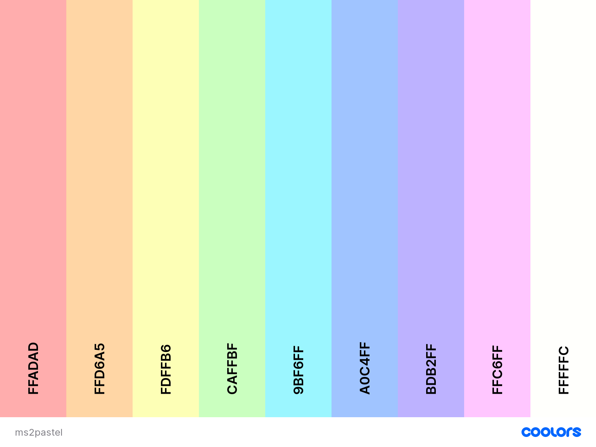
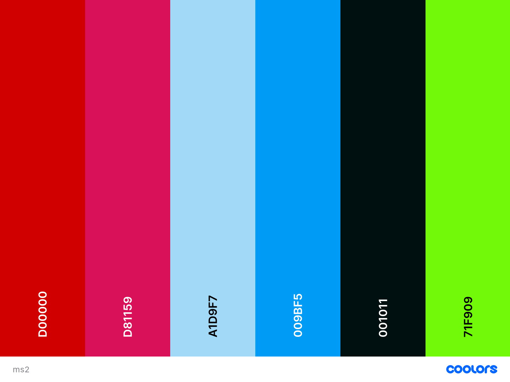

# UX

## Strategy

### Project Goals

The primary goal of the project is to create a site for younger, non-english speaking, learners to learn some basic English vocabulary in a stress-free playful environment. Younger learners enjoy repetitive material and respond better to praise than to new challenges so the site will be designed with this in mind. The material will be easy in order to encourage learners and the graphics used will be consistent with what is attractive to the target audience. The vocabulary chosen is food, animals and clothing because often learners in non English speaking countries are presented with certified English speaking exams that often involve being able to identify this vocabulary when presented with images so the site can function as an effective study aid in order to make the process of learning and studying much less daunting and hopefully much more enjoyable.

**The Ideal User of this site is:**
* Aged 5+ or a younger child with excellent reading skills.
* Someone who enjoys languages and learning new things.
* Someone who has regular access to a phone or computer with internet connection.
* Someome who has been in enrolled in a ESL oral exam such as Trinity's GESE 1 exam.  

### User Stories
* As a first time user I want to learn basic English vocabulary with the aid of intuitive visual images/graphics.

* As a first time user I want to recieve feedback when I interact with the purposely built interactive parts of the site.

* As a first time user I want to intuitively navigate the site to find my desired vocabulary topic with relative ease.

* As a first time user I want to be able to learn vocabulary that is fitting for the level of beginner.

* As a first time user I want to be able to be intuitvely aware of when I have made an error in order to aid my learning.

* As a returning user I want to be able to repeat the proscribed learning material in order to boost familiarity with the new vocabulary and aid the learning process.

* As a returning user I want to boost the learning process by encountering the same visual graphics in order to assist in the memorisation of the vocabulary.
# Structure

## Features

### Footer
The footer code was used twice to alter the display on different screen sizes.

### Design
**Colours**

**Typography**
'Chewy'
'Chilanka'

## Skeleton

### Wireframes

* The wireframes were created using [Balsamiq wireframes](https://balsamiq.com/)

* The wireframe mockup links can be found below:

* [Index Page Wireframes](documentation/wireframes/index-page-frames.pdf)

* [Food Page Wireframes](documentation/wireframes/food-page-frames.pdf)

* [Clothes Page Wireframes](documentation/wireframes/clothes-page-frames.pdf)

* [Event Wireframes](documentation/wireframes/event-frames.pdf)

## Technologies Used
- This project is primarily built using HTML5 semantic markup, CSS stylesheets and Javascript.
-[jQuery](https://jquery.com/)
- [Gitpod](https://gitpod.io)
    - This project was built using Gitpod as the IDE.
- [Google fonts](https://fonts.google.com/) 
    - The font styles used on this website were chosen from Google fonts.
- [Bootstrap 4.5](https://getbootstrap.com/)
   - Various aspects of this website were structured using Bootstrap.
   - Bootstrap was used to make this website responsive
- [TinyJPG](https://tinyjpg.com/)
   - The images represented were compressed using TinyJPG in order to improve the performance of the project. 
- [Fontawesome](https://fontawesome.com/)
    - The icons used on this page were found in Fontawesome.
- [Hover.css](https://ianlunn.github.io/Hover/) 
    - The hover feature of the navigation links below the hero image were implemented using Hover.css. 
- [Popper.js](https://popper.js.org/)
    - Certain bootstrap responsive elements require Popper.js in order to function correctly.
- [Balsamiq](https://balsamiq.com/)
    - The wireframes for this project were created using Balsamiq.
- [FreePik](https://www.freepik.com/)
    - All of the vectors used in this project were found on Freepik. 
- [Freeformatter- CSS beautifier](https://www.freeformatter.com/css-beautifier.html)
    - This was used to format the CSS stylesheet.
- [Freeformatter- HTML formatter](https://www.freeformatter.com/html-formatter.html)
    - This was used to format each HTML page
- [Adobe Photoshop](https://photoshop.adobe.com/) 
    - Some images were resized using Adobe Photoshop.
- [Google DevTools](https://developers.google.com/web/tools/chrome-devtools) 
    - Google Dev Tools was extensively used throughout the project for various styling and testing purposes. Its lighthouse feature was used as one of the main testing tools for this project.
- [Animate.css](https://animate.style/)
- [SweetAlert2](https://sweetalert2.github.io/)
-[EmailJS](https://www.emailjs.com/)
-[CSS-Tricks](https://css-tricks.com/)
-[Favicon.io](https://favicon.io/) 

## Testing
Testing information can be found here in the separate [TESTING.md file](TESTING.md)

## Deployment
This project was developed using [Gitpod IDE](https://gitpod.io) and pushed to Github using the in-built terminal.

This project was deployed from the [Github Respository](https://github.com/AideenM12/Galway-Tours-MS1) to GitHub Pages using the following steps:

1. Log into Github.
2. Select the [AideenM12/Galway-Tours-MS1](https://github.com/AideenM12/Galway-Tours-MS1) respository.
3. Click the settings tab.
4. Scroll to the GitHub Pages section of the page.
5. Under the source heading select the *master* branch option.
6. Click save.
7. The project has now been deployed. Scroll back to the GitHub pages section and click on the link above the source heading to view the live site.

### Making a clone to run locally

1. Log into GitHub.
2. Select the [respository](https://github.com/AideenM12/Galway-Tours-MS1).
3. Click the Code dropdown button next to the green Gitpod button.
4. Download ZIP file and unpackage locally and open with IDE. Alternatively copy the URL in the HTTPS box.
5. Open the alternative editor and terminal window.
6. Type 'git clone' and paste the copied URL.
7. Press Enter. A local clone will be created.

## Credits

### Media
* Dog image was found [Freepik](https://www.freepik.com/vectors/dog)Dog vector created by catalyststuff .
* Cat image was found [Freepik](https://www.freepik.com/vectors/cartoon)Cartoon vector created by catalyststuff 
* Lion image was found [Freepik](https://www.freepik.com/vectors/logo)Cartoon vector created by catalyststuff
* Penguin image was found [Freepik](https://www.freepik.com/vectors/winter)Cartoon vector created by catalyststuff
* Elephant image was found [Freepik](https://www.freepik.com/vectors/baby)Cartoon vector created by catalyststuff
* Panda Bear image was found [Freepik](https://www.freepik.com/vectors/baby)Cartoon vector created by catalyststuff
* Pig image was found [Freepik](https://www.freepik.com/vectors/food)Food vector created by catalyststuff
* Cow image was found [Freepik](https://www.freepik.com/vectors/music)Music vector created by catalyststuff 
* Mouse image was found [Freepik](https://www.freepik.com/vectors/food)Food vector created by catalyststuff 
* Rabbit image was found [Freepik](https://www.freepik.com/vectors/design)Design vector created by catalyststuff 
* Horse image was found [Freepik](https://www.freepik.com/vectors/nature) Nature vector created by catalyststuff 
* Parrot image was found [Freepik](https://www.freepik.com/vectors/cartoon) Cartoon vector created by catalyststuff 
* Turtle image was found [Freepik](https://www.freepik.com/vectors/cartoon)Cartoon vector created by catalyststuff 
* Duck image was found[Freepik](https://www.freepik.com/vectors/baby)Baby vector created by catalyststuff 
* Shark image was found [Freepik](https://www.freepik.com/vectors/water)Water vector created by catalyststuff 
* Owl image was found [Freepik](https://www.freepik.com/vectors/food) Food vector created by catalyststuff 
* Unicorn image was found [Freepik](https://www.freepik.com/vectors/nature)Nature vector created by catalyststuff

* Strawberry image was found [Freepik](https://www.freepik.com/vectors/food)food vector created by gstudioimagen
* Pizza image [FreePik](https://www.freepik.com/vectors/food)Food vector created by catalyststuff
* Burger image [FreePik](https://www.freepik.com/vectors/food)Food vector created by catalyststuff 
* Coffee image [FreePik](https://www.freepik.com/vectors/food)Food vector created by catalyststuff  
* Icecream image [FreePik](https://www.freepik.com/vectors/food)Food vector created by catalyststuff 
* Cookies image [FreePik](https://www.freepik.com/vectors/food)Food vector created by catalyststuff 
* Chocolate image [FreePik](https://www.freepik.com/vectors/food)Food vector created by catalyststuff 
* Cheese image [FreePik](https://www.freepik.com/vectors/food)Food vector created by catalyststuff 
* Meat image [FreePik](https://www.freepik.com/vectors/food)Food vector created by catalyststuff 
* Salad image [FreePik](https://www.freepik.com/vectors/food)Food vector created by catalyststuff 
* Fruit image [FreePik](https://www.freepik.com/vectors/food)Food vector created by catalyststuff 
* Candy image [FreePik](https://www.freepik.com/vectors/food)Food vector created by catalyststuff 
* Bread image [FreePik](https://www.freepik.com/vectors/food)Food vector created by catalyststuff
* Chicken image [FreePik](https://www.freepik.com/vectors/food)Food vector created by catalyststuff
* Fish image [FreePik](https://www.freepik.com/vectors/food)Food vector created by catalyststuff

* Clock image [Freepik](https://www.freepik.com/vectors/hand)Hand vector created by catalyststuff 
* Crayons image [Freepik](https://www.freepik.com/vectors/box)Box vector created by catalyststuff 
* Book image [Freepik](https://www.freepik.com/vectors/book)Book vector created by catalyststuff 
* Phone image [Freepik](https://www.freepik.com/vectors/heart)Heart vector created by catalyststuff

* Littleboy and littlegirl images were found [Freepik](https://www.freepik.com/vectors/girl)Frame vector created by brgfx
* Astronaut image were found [Freepik](https://www.freepik.com/vectors/heart)Heart vector created by catalyststuff 
* 404astro image [Freepik](https://www.freepik.com/vectors/logo)Logo vector created by catalyststuff 

### Code
* The Javascript aspects of this site were inspired by a tutorial found on [codeexplained.org](https://www.codeexplained.org/2018/10/create-multiple-choice-quiz-using-javascript.html)

Other important resources for basic tutorials and troubleshooting resources include:
* [Stack Overflow](https://stackoverflow.com/)
* [W3Schools](https://www.w3schools.com/)
* [Youtube](https://www.youtube.com/)
* [Codepen.io](https://codepen.io/)
* [CodeInstitute](https://codeinstitute.net/) 

### Acknowledgements