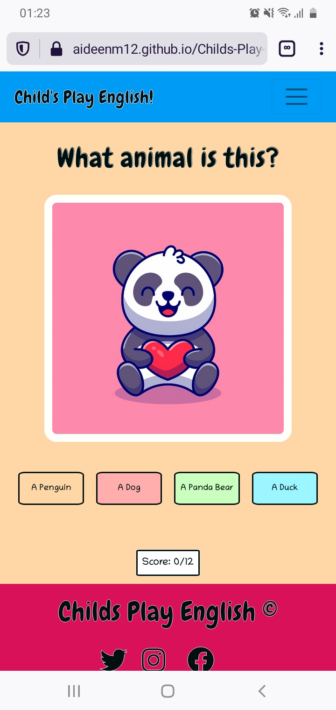
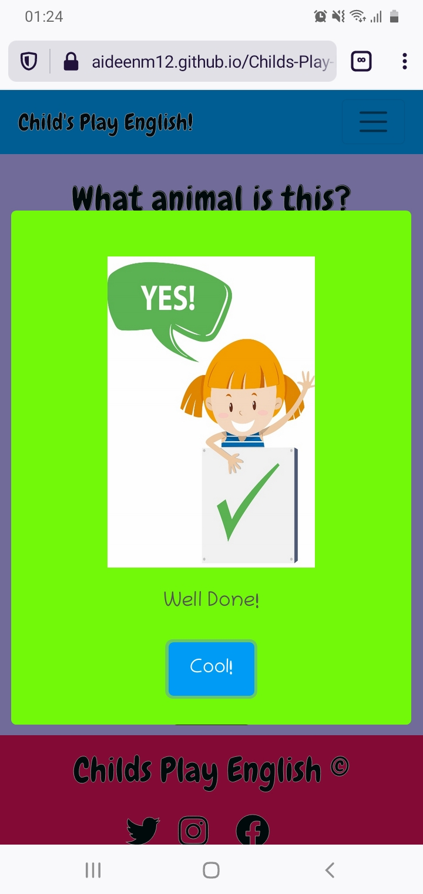
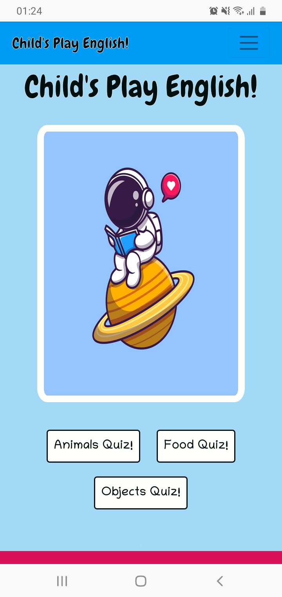
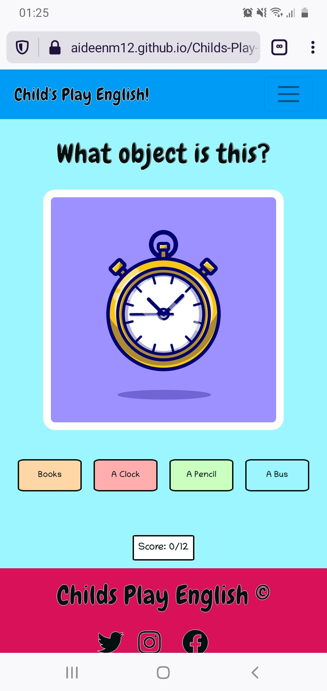
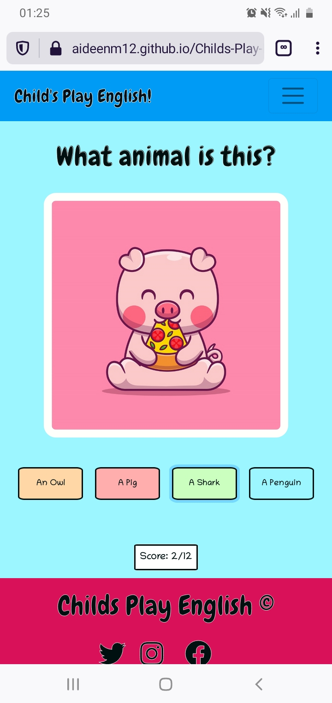
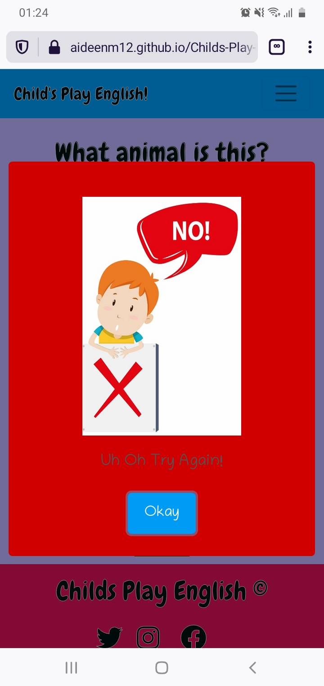

### Testing User Stories

* As a first time user I want to learn basic English vocabulary with the aid of intuitive visual images/graphics.

* As a first time user I want to recieve feedback when I interact with the purposely built interactive parts of the site.

* As a first time user I want to intuitively navigate the site to find my desired vocabulary topic with relative ease.

* As a first time user I want to be able to learn vocabulary that is fitting for the level of beginner.

* As a first time user I want to be able to be intuitvely aware of when I have made an error in order to aid my learning.

* As a returning user I want to be able to repeat the proscribed learning material in order to boost familiarity with the new vocabulary and aid the learning process.

* As a returning user I want to boost the learning process by encountering the same visual graphics in order to assist in the memorisation of the vocabulary.

### Validators
* All Javascript code was passed through the [JShint](https://jshint.com/) validator with little to no issues with the exception of 'let', 'const' and template literals being available in ES6 and the '$' being recognised as an unused variable. Screenshots of the results of these files can be found below:

* [quiz.js validator results](documentation/doc-images/jShintquestions.png)

* [main.js validator results](documentation/doc-images/jShintMain.png)

* [email.js validator results](documentation/doc-images/emailJsjshint.png)

* All HTML passed through the prescribed [W3C validator](https://validator.w3.org/) with no issues. Screenshots of the results of these files can be found below:

* [index.html validator results](documentation/doc-images/index-validator.w3.png)

* [contact.html validator results](documentation/doc-images/contact-validator.w3.png)

* [404.html validator results](documentation/doc-images/404-validator.w3.org.png)

* All CSS passed through the prescribed [Jigsaw CSS validator](https://jigsaw.w3.org/css-validator/) with no issues. A screenshot of the results can be found below:

* [CSS validator results](documentation/doc-images/jigsaw.w3.png)

* Testing was performed in the following browsers on both laptop and mobile devices:
    - Google Chrome

    - Mozilla Firefox

    - Opera 

    - Microsoft Edge

    - Internet Explorer

    No issues were detected in any of these browsers at the time of submission.

    The below image is an example result of lighthouse testing performed on the index page for mobile with every other test achieving similar results. The lighthouse tool found in Google Dev Tools was used repeatedly throughout the building of the project and was essential in discovering and resolving the issues described below. A lighthouse test was performed on both mobile and desktop for each individual page on the site with links to the full reports of each of these tests found below. The lighthouse tool tested each of the following criteria: performance, accessibility, best practices and SEO of each individual page in both mobile and desktop. Each test resulted in a score of 70 or above for each of the aforementioned criteria.

    [Lighthouse Desktop Index page results](documentation/doc-images/indexlightMS2desktop.pdf) |
    [Lighthouse Mobile Index page results](documentation/doc-images/indexMS2lightmobile.pdf)

    [Lighthouse Desktop Contact page results](ddocumentation/doc-images/contactlightMS2desktop.pdf) | 
    [Lighthouse Mobile Contact page results](documentation/doc-images/contactlightMS2mobile.pdf) 

## Testing Features