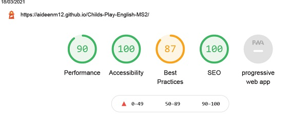

## Testing User Stories

* As a first time user I want to learn basic English vocabulary with the aid of intuitive visual images/graphics.

    - All graphics were chosen specfically to appeal to the target audience and scaled to fit all potential devices. Each image depicts the target language in a clear and non-confusing way.

          

* As a first time user I want to recieve feedback when I interact with the purposely built interactive parts of the site.

     - The SweetAlert pop ups are designed to ensure that even users with a virtually non-existant level of English can be sure that they have selected the correct answer. The green color and the affirmative 'Yes' presented in the image provide two indications and green is often used as an affirmative color globally.

    
* As a first time user I want to intuitively navigate the site to find my desired vocabulary topic with relative ease.

     - The quiz topics are presented directly below the hero image and visable on all screen sizes so that the user can navigate based on their own curiousity and the nav-heading and h1 tag are both interactively linked to the home-page so that users can find themselves back at the home-page easily to explore the other quizzes.

    
* As a first time user I want to be able to learn vocabulary that is fitting for the level of beginner.

    - All vocabulary has been selected based on the vocabulary covered in children's beginner English exams and is often the same vocabulary they encounter in the school enviroment both in their native language and English.

    

* As a first time user I want to be able to be intuitvely aware of when I have made an error in order to aid my learning.

    - The red SweetAlert pop is designed to ensure that users are aware that they have made an error. The animate.css animation chosen for this pop up was also chosen to indicate error in that it is not a sleek movement but rather a stiff and jarring movement designed to halt the user. 

  
* As a returning user I want to be able to repeat the proscribed learning material in order to boost familiarity with the new vocabulary and aid the learning process.

    - Twelve questions are selected from a slightly larger bank in order to give the user a slightly newer experience upon their first returning visit but the material remains mostly the same in order to boost familiarity and confidence with the target language. 

* As a returning user I want to boost the learning process by encountering the same visual graphics in order to assist in the memorisation of the vocabulary.

    - The images presented with the target language do not change. There is no variety of images when studying a specific piece of vocabulary so the user can learn through the repetition of the visual aids alongside the target language. 

### Validators
* All Javascript code was passed through the [JShint](https://jshint.com/) validator with little to no issues with the exception of 'let', 'const' and template literals being available in ES6 and the '$' being recognised as an unused variable. Screenshots of the results of these files can be found below:

    - [quiz.js validator results](documentation/doc-images/jShintquestions.png)

    - [main.js validator results](documentation/doc-images/jShintMain.png)

    - [email.js validator results](documentation/doc-images/emailJsjshint.png)

* All HTML passed through the prescribed [W3C validator](https://validator.w3.org/) with no issues. Screenshots of the results of these files can be found below:

    - [index.html validator results](documentation/doc-images/index-validator.w3.png)

    - [contact.html validator results](documentation/doc-images/contact-validator.w3.png)

    - [404.html validator results](documentation/doc-images/404-validator.w3.org.png)

* All CSS passed through the prescribed [Jigsaw CSS validator](https://jigsaw.w3.org/css-validator/) with no issues. A screenshot of the results can be found below:

    - [CSS validator results](documentation/doc-images/jigsaw.w3.png)

* Testing was performed in the following browsers on both laptop and mobile devices:
    - Google Chrome

    - Mozilla Firefox

    - Opera 

    - Microsoft Edge

    - Internet Explorer

    No issues were detected in any of these browsers at the time of submission.

    The below image is an example result of lighthouse testing performed on the index page for mobile with every other test achieving similar results. The lighthouse tool found in Google Dev Tools was used repeatedly throughout the building of the project and was essential in discovering and resolving the issues described below. A lighthouse test was performed on both mobile and desktop for each individual page on the site with links to the full reports of each of these tests found below. The lighthouse tool tested each of the following criteria: performance, accessibility, best practices and SEO of each individual page in both mobile and desktop. Each test resulted in a score of 70 or above for each of the aforementioned criteria.

    

    [Lighthouse Desktop Index page results](documentation/doc-images/indexlightMS2desktop.pdf) |
    [Lighthouse Mobile Index page results](documentation/doc-images/indexMS2lightmobile.pdf)

    [Lighthouse Desktop Contact page results](ddocumentation/doc-images/contactlightMS2desktop.pdf) | 
    [Lighthouse Mobile Contact page results](documentation/doc-images/contactlightMS2mobile.pdf) 

## Testing Features

    ### Navigation 
    * On the home page click the "Child's Play English" header on the top left corner to navigate to the home page.
    * On the contact page click the "Child's Play English" header on the top left corner to navigate to the home page.
    * On the 404 page click the "Child's Play English" header on the top left corner to navigate to the home page.
    * Alternatively click "Home" on the top right corner to navigate to the home page on the home page, contact page and      404 page.
    * On the home page, contact page and 404 page click "Contact/About" to navigate to the contact page. On mobile this can   be selected from the dropdown menu.

    ### Quiz functions
    * When the Animals Quiz button is selected ensure that users are brought to the quiz that selects questions from the questions array.
    * When the Food Quiz button is selected ensure that users are brought to the quiz that selects questions from the foodQuestions array.
    * When the Objects Quiz button is selected ensure that users are brought to the quiz that selects questions from the objectQuestions array.

    ### Social Media links
    * When the facebook icon is clicked ensure that the user is brought to the facebook homepage in a new tab.
    * When the instagram icon is clicked ensure that the user is brought to the instagram homepage in a new tab.
    * When the twitter icon is clicked ensure that the user is brought to the twitter homepage in a new tab.

    ### Buttons

### Known Bugs and Issues

* When the random quiz function was first implemented it did not handle repeat questions effectively at all. With some guidance from my classmate Kotaro Tanaka I was able to effectively tackle this issue with the following code.

        - if (!usedQuestions.includes(randomQuestion)) { 
		console.log(randomQuestion);
		usedQuestions.push(randomQuestion); 
	    } else {
		randomQuiz();
	    }

This code was inserted into the randomQuiz function and, along with the usedQuestions array, effectively prevented questions repetition. However when this code was implemented it created a new issue. The food question array stopped calling the else if (questionCount == 12) statement of the checkSolutions function and displayed the questionCount numbers in the console on an infinite loop and stopped handling user interactions effectively. After using the debugger tool in google dev tools with the help of student support it was discovered that the askQuestion function that was being called inside the chooseObjectQuiz and chooseFoodQuiz functions was causing extra questions to be called and discarded before a question is displayed in the DOM. This caused the foodQuestions bank to be less than the required 12 questions needed to call the else if (questionCount == 12) statement of the checkSolutions function. The askQuestion function was removed from these two functions and the problem was rectified. 